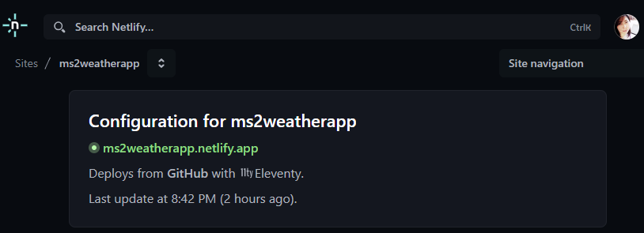
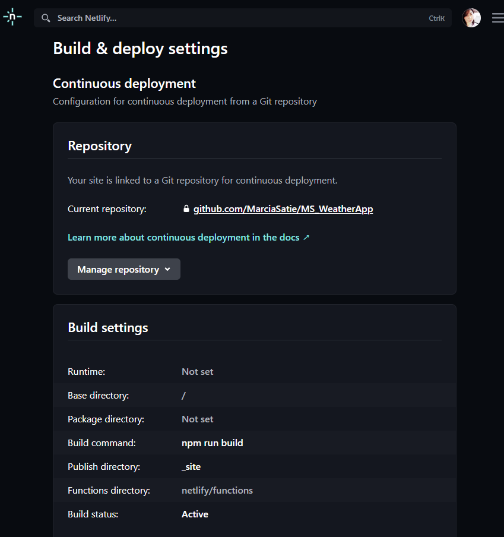

# MS2 Weather App 🌦️


# 🌤️ CityFocus - Weather App

## 🔗 Live Demo
[Visit the app at Netlify](https://ms2weatherapp.netlify.app/cityfocus/?city=berlin)

## 📜 Description
A dynamic and interactive weather web application that allows users to check real-time weather conditions in listed city. Developed as part of the Web Development course assignment, the app provides a clean UI, live weather data, and city-based navigation.

## 🎯 Features
-  Responsive design for desktop and mobile
### 📄Dashboard
-  Displays list of cities and clickin in each city will open City Focus page from this specific city.
- Show list of favorite Cities. (Based on Preferences page.)
### 📄City Focus
-  City Focus page shows specific details from selecred City: 
<br> * Weekly temperature information. (Starting from next day from today.)
<br> * Hourly temperature for the next 6 hours. 
    
-  Shows temperature, wind, max temperature, minimum temprature, max wind. 

### 📄Preferences
The Preferences page allows users to customize their weather experience in the app. It is divided into two main sections:

##### 🌆 Favorite Cities
- Users can select or deselect cities to mark as favorites.
- Selected cities may be prioritized or highlighted in teh Dashboard.
- Options are displayed as checkboxes generated dynamically with JavaScript, oce Apply Changes button is clicked.
- Includes buttons:
  - **Apply Changes** – saves and load the selected favorites.
  - **Reset Favorites** – clears all selections.

##### 🛠️ Other Settings
This section allows users to configure additional display preferences:
- **Default City Selector**:
  - A dropdown menu populated with available cities.
  - Determines which city is shown clicking at City Focus nav button.
  - ** Last Seen City ** - is the last dropdown option, this option will diplay the last city focus seen in the Dashboard as default.
- **Weather Image Settings**:
  - Users can select which set of images to use for displaying weather conditions (clean weather/ cloud/rainy).
  - Choosing Day option, will display set of daylight images.
  - Choosing for Night option, will display set of night images.
  - Vhoosing for ByHour option, will display set of Day or Night depending on the current time the brouse is loaded. 
- **City Focus Settings**:
  - Option to show or hide wind data in the hourly forecast using a simple checkbox.
- A button labeled **Apply Changes** saves and load all the updated settings. 

## 🚀 Technologies Used
- HTML
- BULMA, CSS
- JavaScript
- Eleventy
- Netlify (for deployment)

## 🖼️ Images
- Flatiicon (https://www.flaticon.com/)
- Fontwesome (https://fontawesome.com/)

## 🧪 How to Run the Project Locally
Clone the repository:
git clone  (https://github.com/MarciaSatie/WeatherApp.git)
<br>
Prerequisites
Node.js (version 14 or higher) ​(https://nodejs.org/en/download)


## Quick install

### install NPM

```sh
npm install
```

### Run the development server:

```sh
eleventy --serve
```

### Local Host

```sh
http://localhost:8080/.
```

## 📂 Folder Structure

```plaintext
WeatherApp/
├── _includes/           # Reusable components for templating
├── _site/               # Output folder generated by 11ty (do not edit directly)
├── assets/              # Images and static files
├── data/                # Data files for dynamic content
├── node_modules/        # Node.js dependencies (auto-generated)
├── src/                 # Source files for the application
├── .eleventy.js         # Eleventy configuration file
├── README.md            # Project documentation
├── city_focus.njk       # Template for city weather display
├── dashboard.njk        # Template for main dashboard
```

📦 Dependencies
Eleventy: Static site generator.​
<br>JavaScript: Handles data fetching and DOM manipulation.​

## 📸 Screenshots
### 📍 Netlify - Deploying from Github



## 🙌 Acknowledgments

**Permalinks** : to customise templates locations (used at nav.js)<br>
reference: https://www.11ty.dev/docs/permalinks/

**Date**(at file: utils.js): return current Date and has methods to get current hour.
reference:https://www.w3schools.com/jsref/jsref_obj_date.asp

**document.createElement**(at file: utils.js): uses Javascript to create a new HTML element at this case a div.
reference: https://www.w3schools.com/jsref/met_document_createelement.asp

**replaceAll** (at file: utils.js): replace all specified string (or char) at whole variable.
reference: https://developer.mozilla.org/en-US/docs/Web/JavaScript/Reference/Global_Objects/String/replaceAll

**event.currentTarget.id**(at dashboard.njk) this will return the value from the ID from the module related to action click (at this case <a>).
event -> carries all the information from action click and it is passed as a parameter inside of the function myFunction
reference: https://developer.mozilla.org/en-US/docs/Web/API/Event/currentTarget

**Tenary Expression**(at preference.njk) Just a simpler and easy to read way to write if and else. I particularly I like, and I am trying to use it more.
reference: https://developer.mozilla.org/en-US/docs/Web/JavaScript/Reference/Operators/Conditional_operator

**JSON.parse and JSON Strigfy**(at preference.njk) As adding direct the array to localStorage will transform everything in a unique string, I need somethinf that will tranform all array's code ina  string. 
reference: https://www.geeksforgeeks.org/how-to-store-an-array-in-localstorage/

**Regex** (at file: header.njk): Regular expression, with a partten of cahracters, allowed me to take of specific characters from a string, using .replace()
reference: https://developer.mozilla.org/en-US/docs/Web/JavaScript/Guide/Regular_expressions/Character_classes
 https://www.debuggex.com/cheatsheet/regex/javascript

 ````
regex : /\/+$/ => 
/content/ -> what is between slashes will be count in cosideration for regex .
\/+ ->  To match this / character literally (thsi what I want to get rid off) , escape it with itself. In other words to search for \ use \// (+ -> 1 more, at this case to repit "/" to achive \//).
$ -> end of the string
````

## 🙋‍♂️ Author
Made with ❤️ by [Marcia Satie](https://github.com/yourusername)


